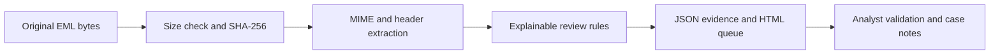

# Phishing Evidence Lab

An offline SOC investigation workbench that turns `.eml` files into an explainable evidence queue, JSON findings, and a readable HTML case report. Built for learning how to **support a verdict with evidence**, including when a detector flags a legitimate message.

**Status:** AI-assisted implementation created and tested by the assistant on September 6, 2026. Zagros's personal reproduction and reflection are pending. All included messages are original, synthetic, and inert. This is a training tool, not production SOC experience or a validated email-security product.

## Run it

Python 3.10 or later; standard library only. No account, API key, subscription, or package installation required.

```sh
git clone https://github.com/CyberZag/101-cybersecurity-analyst.git
cd 101-cybersecurity-analyst/02-phishing-evidence-lab
python make_samples.py
python -m unittest -v
python triage.py samples --out reports
```

Open `reports/report.html` in a browser. The report uses local inline styling, escapes message text, has no JavaScript or clickable message URLs, and blocks network resources with a Content Security Policy. The JSON retains original URL strings for analyst use. Do not publish JSON from real mail: it may contain private data.

## Workflow



The tool never connects to the network, opens links, executes attachments, or automatically blocks a sender. It hashes decoded leaf attachment bytes without extracting files. Attached email containers need separate investigation; they are not interpreted as the outer email body.

## What the rules actually mean

| Rule | Observation | Why it is not a verdict |
|---|---|---|
| HEADER_AMBIGUITY | Missing, duplicate, or multiple From identities | Could be malformed legitimate mail |
| REPLY_DOMAIN_DIFFERS | Exact From and Reply-To domains differ | Legitimate vendors and partner workflows do this |
| REPORTED_AUTH_FAILURE | A header string claims SPF, DKIM, or DMARC failure | Header provenance and receiving gateway logs must be validated |
| LINK_LABEL_MISMATCH | A visible HTTP URL and anchor target have different hosts | Redirect/tracking systems can create differences |
| URL_USERINFO | An HTTP URL contains text before `@` | The destination host is after `@`; investigate why userinfo exists |
| REVIEW_ATTACHMENT_TYPE | Filename has an active-content or disk-image extension | Extension alone says nothing about the actual payload |
| PARSER_DEFECT / MALFORMED_URL | Input cannot be fully interpreted | Extraction may be incomplete |

`review_required` means at least one observation needs analyst attention. `no_rule_match` **does not mean safe**. There is no invented probability score or automatic malicious verdict. Authentication results remain explicitly **unverified**, including when a header says `pass`.

## Six cases and expected reasoning

| Fixture | Expected queue result | Analyst learning objective |
|---|---|---|
| 01 routine | No rule match | Explain why absence of matches is not proof of safety |
| 02 link mismatch | Review | Correlate Reply-To, link mismatch, and an unverified auth failure |
| 03 attachment | Review | Reproduce the SHA-256; explain extension versus content |
| 04 benign control | Review | Recognize a known legitimate partner workflow can trigger a rule |
| 05 auth pass trap | Review | Identify actual URL host despite a passing auth claim |
| 06 auth failure | Review | Investigate failure provenance without assuming phishing |

The expected result is **six messages, five requiring review, zero parse errors**. Case 04 is deliberately a benign control. This corpus tests behavior and analyst reasoning; it cannot estimate real-world precision, recall, or malware detection quality.

## Evidence and interview practice

- [Execution evidence](reports/validation.txt): actual assistant-run commands and results.
- [Generated HTML report](reports/report.html): download/open locally; GitHub may show source.
- [Structured output](reports/findings.json): reproducible original hashes and extracted evidence.
- [Case investigation](docs/case-investigation.md): observations, unknowns, recommended next actions, and false-positive handling.
- [Learning and interview guide](docs/learning-guide.md): exercises to reproduce before making personal experience claims.

## Boundaries and limitations

Maximum input size is 5 MiB per message. Batch failures are recorded in JSON and return nonzero status; an HTML warning identifies partial runs. Keep input and output folders separate. Plain URLs and basic HTML anchors are supported; complex obfuscation, JavaScript, OCR, archive expansion, nested email investigation, DNS, reputation, SPF evaluation, DKIM verification, ARC, and DMARC organizational-domain alignment are outside scope. The parser is not a full RFC Authentication-Results evaluator: failure matching is a string heuristic. Exact host comparison is not proof of brand impersonation. The tool is designed for these small training fixtures, not unrestricted hostile-message processing.

## Technical references

- [RFC 8601, trust boundary and forged header considerations](https://www.rfc-editor.org/rfc/rfc8601.html#section-7.1): an arbitrary authentication header is not automatically trustworthy.
- [Python email parser](https://docs.python.org/3/library/email.parser.html): MIME/header parsing API.
- [Microsoft phishing investigation playbook](https://learn.microsoft.com/en-us/security/operations/incident-response-playbook-phishing): investigation context for email, endpoints, and user impact.

These references inform the design; fixtures and implementation are original. No commercial training content or real user mail is included.
